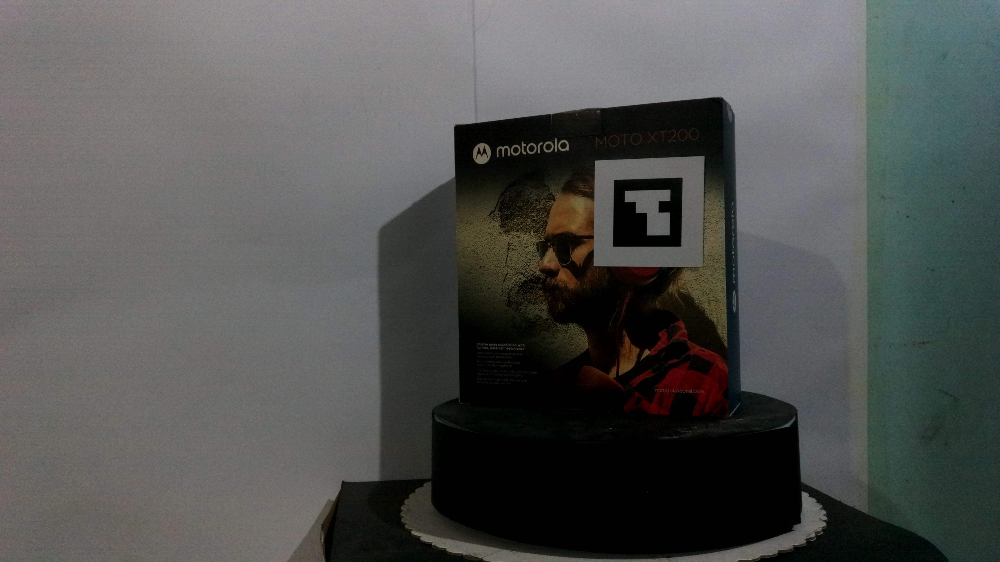
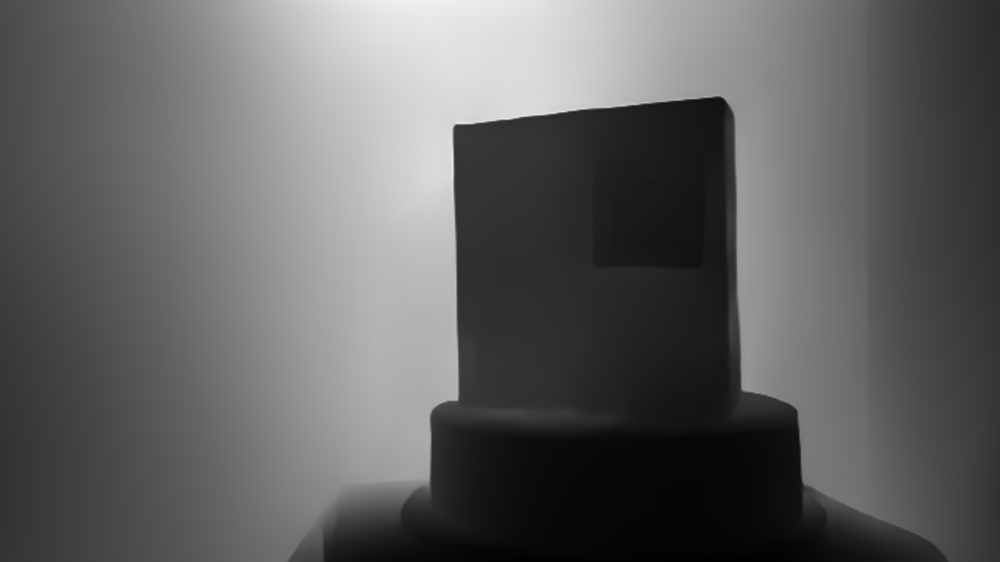

# CRA2M - Conversion of Relative to Absolute Depth Maps with Reference Markers

> **Repository:** `cra2m-depth-scaling`  
> **Author:** Rolando Cortez (Electronic Engineer, Computer Vision)

---

## 📋 Overview

**CRA2M** (Conversion of Relative to Absolute Depth Maps with Reference Markers) transforms relative depth maps produced by **MiDaS** into metric-scale depth maps using **ArUco marker detection** and **solvePnP**.

This implementation is based on **Chapter 6** of my undergraduate thesis (Universidad Simón Bolívar, 2025).

---

## 🔥 Motivation

While the scale problem in monocular depth maps is well-known, CRA2M brings an original integration of:

- **MiDaS** for relative depth estimation.
- **ArUco markers** as physical references.
- **solvePnP** for computing a scale factor — and optionally a **shift** using a two-point system.
- `scale-shift` mode for refined estimation via linear system using 2 known 3D points.
- Support for both **OAK-1 (DepthAI)** and generic **webcam** inputs.

---

## 🗂️ Project Structure

```bash
cra2m-depth-scaling/
├── src/
│   ├── depth_scaler.py        # CRA2M core implementation
│   ├── utils.py               # Utility functions
│   ├── oak_camera_pipeline.py # OAK-1 camera control
│   └── webcam_pipeline.py     # Generic webcam support
├── tools/
│   ├── run_demo.py            # Process single image
│   ├── run_live_demo.py       # Live demo (OAK-1 or webcam)
│   └── calibrate_camera.py    # Image capture + calibration
├── data/
│   ├── calib_imgs/            # Captured calibration images
│   └── calib_results/         # Output calibration files (intrinsics)
├── models/                    # (Optional) Local MiDaS model
│   └── hub/checkpoints/dpt_large_384.pt
├── example_images/            # Input samples
├── output/                    # Output results
├── requirements.txt
├── README.md
├── LICENSE
└── .gitignore
```

---

## 🚀 Command Cheat Sheet

### 1. Process a Single Image
```bash
python tools/run_demo.py \
  --image_path example_images/capture_0.png \
  --camera_matrix data/calib_results/cam_mtx.npy \
  --dist_coeffs data/calib_results/cam_dist.npy \
  --marker_size 0.05 \
  --mode scale-shift \
  --rounds 3 \
  --output_dir output/ \
  --use_local_model
```

### 2. Live Depth Estimation (OAK-1)
```bash
python tools/run_live_demo.py \
  --camera_type oak \
  --camera_matrix data/calib_results/cam_mtx.npy \
  --dist_coeffs data/calib_results/cam_dist.npy \
  --mode scale \
  --use_local_model
```

### 3. Live Depth Estimation (Webcam)
```bash
python tools/run_live_demo.py \
    --camera_type oak \
    --camera_matrix data/calib_results/cam_mtx.npy \
    --dist_coeffs data/calib_results/cam_dist.npy \
    --marker_size 0.05 \
    --mode scale-shift \
    --use_local_model \
    --flip 
```
or

```bash
python tools/run_live_demo.py \
    --camera_type webcam \
    --camera_matrix data/calib_results/cam_mtx.npy \
    --dist_coeffs data/calib_results/cam_dist.npy \
    --marker_size 0.05 \
    --mode scale-shift \
    --use_local_model
```

### 4. Camera Calibration
```bash
python tools/calibrate_camera.py \
  --camera_type oak \
  --output_dir data/calib_imgs/oak/ \
  --result_dir data/calib_results/oak/ \
  --num_images 20 \
  --cam_width 3840 \
  --cam_height 2160
```

---

## ⚠️ Notes

### ➤ Local MiDaS Model Support

To avoid downloading the MiDaS model via `torch.hub`, you may place it manually at:

```
models/hub/checkpoints/dpt_large_384.pt
```

And run any script with the `--use_local_model` flag.

---

### ➤ OpenCV GUI Error (imshow)

If you see an error like:

```
cv2.error: The function is not implemented. Rebuild the library with GUI support...
```

It means you have `opencv-python-headless` installed. Fix it with:

```bash
pip uninstall opencv-python-headless opencv-python
pip install opencv-python==4.8.0.76
```

---

## ⚙️ Requirements

- Python 3.9+
- Dependencies listed in `requirements.txt`

Install:

```bash
pip install -r requirements.txt
```

> Note: PyTorch may require a manual installation depending on your CUDA version.

---

## 📸 Expected Output

- Input: RGB image
- Output: 
  - Absolute depth map: `depth_map_abs.npy`
  - Visual depth overlay: `depth_map_vis.png`

| Input RGB | Absolute Depth |
|:---------:|:---------------:|
|  |  |

---

## 🤝 Credits and License

- Built using principles from MiDaS, OpenCV ArUco, and solvePnP.
- Original modular implementation by **Rolando Cortez García**.
- License: **CC BY-NC 4.0** (Attribution-NonCommercial).

---

## 📨 Contact

**Rolando Cortez García**  
Email: rolscg@gmail.com  
GitHub: [rolandocortez](https://github.com/rolandocortez)  
LinkedIn: [rolando-cortez](https://www.linkedin.com/in/rolando-cortez/)

---

> "Detect, analyze, adapt — one frame at a time." 🚀

